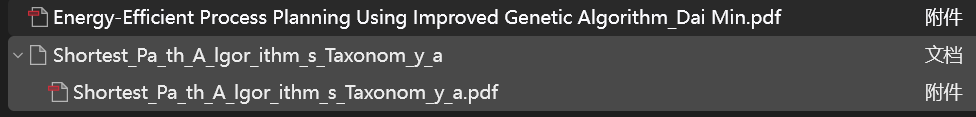
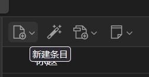
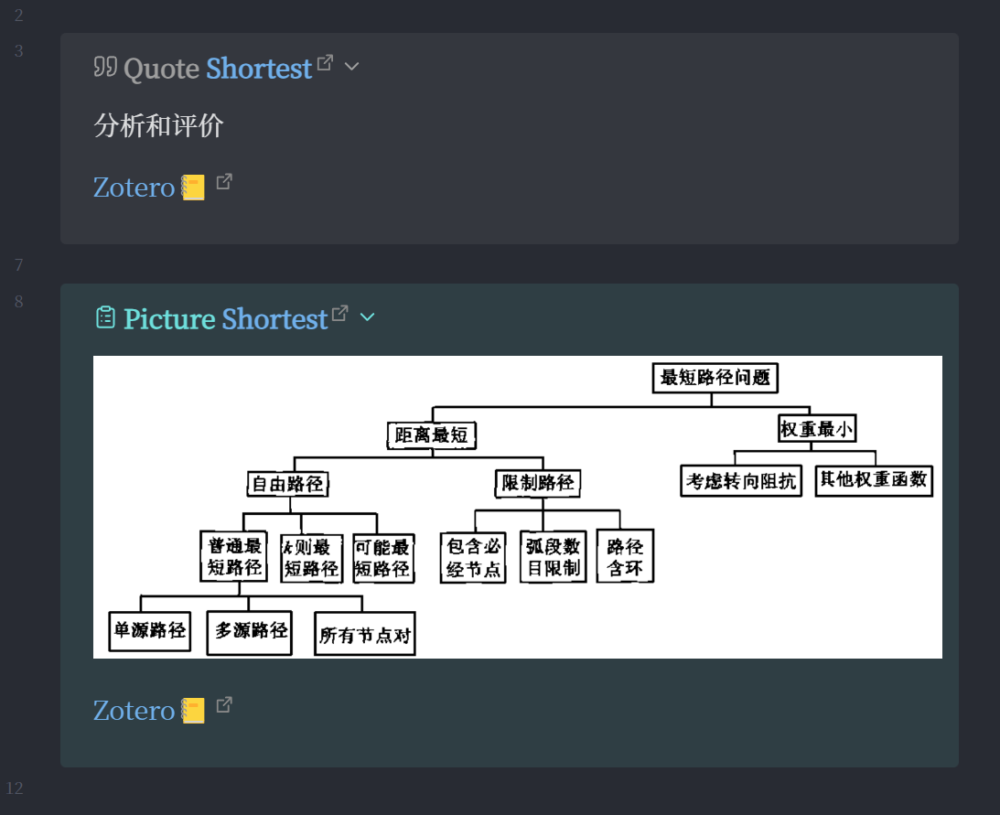
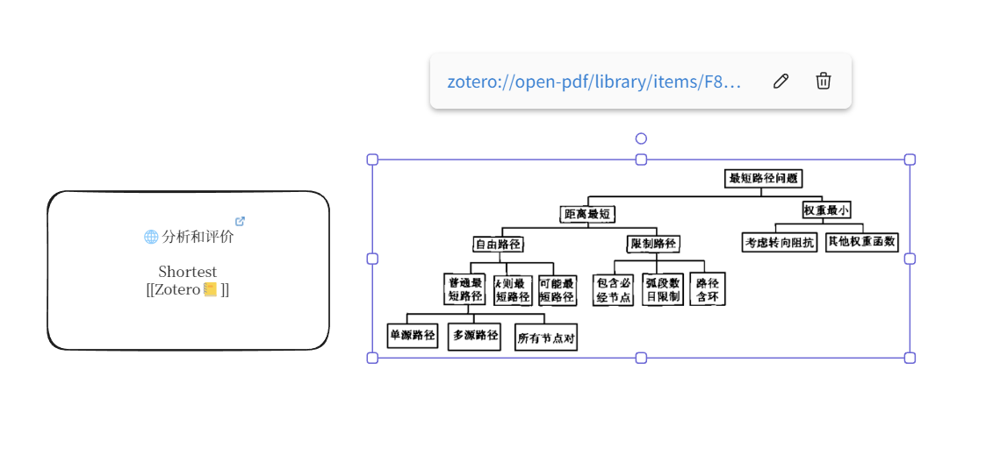
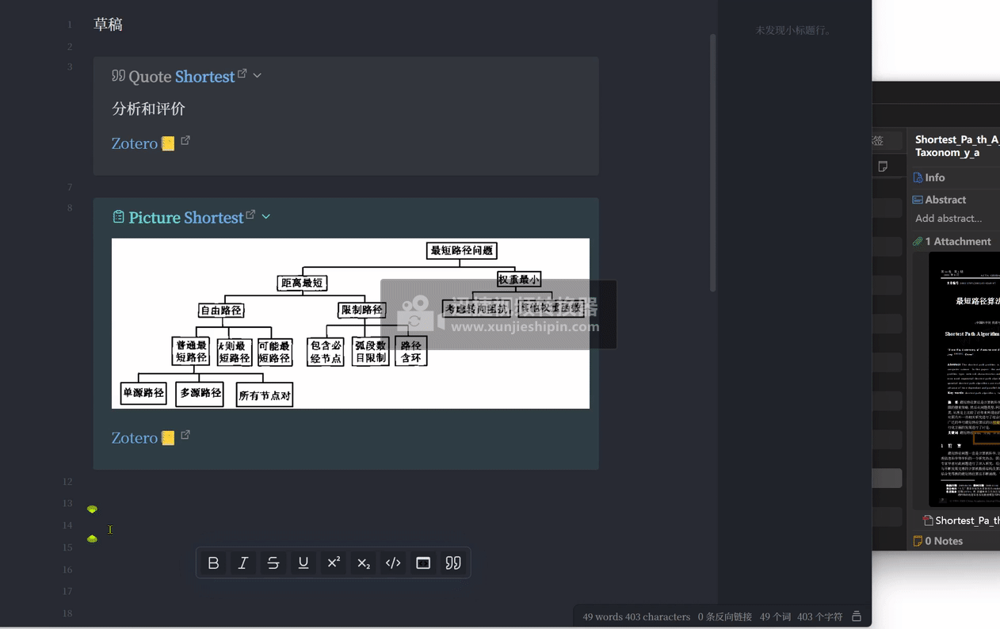
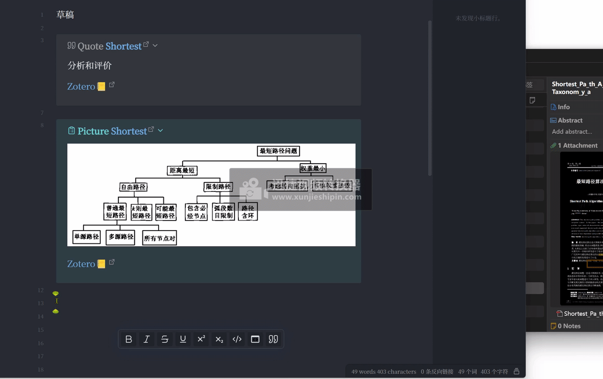
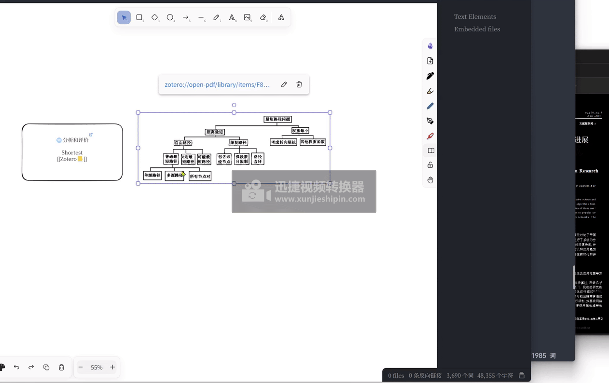
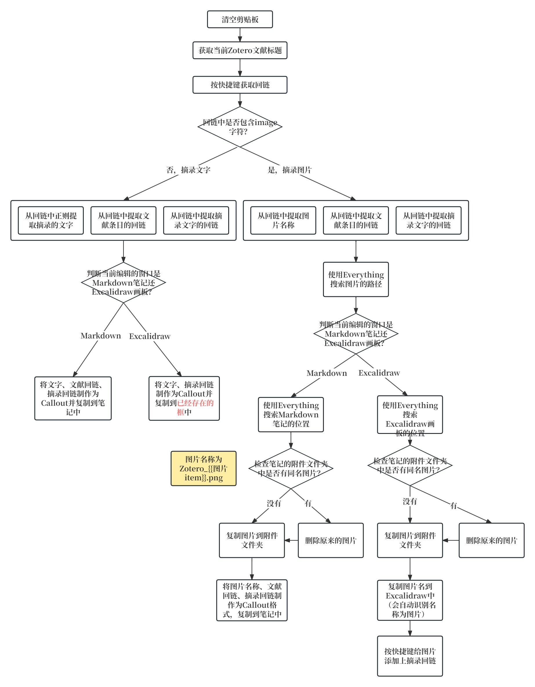

### 用Quicker设置Obsidian到Zotero的跳转、回链动作

用Quicker可以帮助我们完成一些繁琐的、需要多个操作步骤的动作。

这篇文章中，我用Quicker帮我完成对Zotero的复制文字、复制图片、复制回链、复制图片到Obsidian文件夹、将链接按照callout格式复制到Obsidian笔记中，使之点击Obsidian中的链接能自动打开Zotero，并跳转到笔记的所在位置。

文献在Zotero中有两种存在方式，一种是单独pdf，如下图的“Energy……”。如果将pdf电子书、或者少数没有条目的文献拖入Zotero，则只有单独的pdf。

另一种是以条目的形式存在，将pdf文献拖入Zotero中，大多数都会直接创建条目信息，如下图的“Shortest……”

目前本文的Quicker动作只能用于有条目的pdf，对于没有条目的，点击左上角的“新建条目”，选择类型，手动创建与pdf同名的条目，并将pdf放在该条目中。

为了按快捷键复制的时候，能直接复制原文和链接，需要设置“导出”—“笔记格式”，把这两个都勾选上“包括Zotero链接”。

接下来是回链的类型，包括文字回链和图片回链（默认pdf以上述的条目形式存在）。

文字回链：

`“分析和评价” ([“Shortest_Pa_th_A_lgor_ithm_s_Taxonom_y_a”, p. 269](zotero://select/library/items/JVT8PXSV)) ([pdf](zotero://open-pdf/library/items/F8KWNWMZ?page=1&annotation=SW5BIEP5)) `

内容是摘录的文字、条目的回链、摘录文字的回链。

图片回链：

`[image]([pdf](zotero://open-pdf/library/items/F8KWNWMZ?page=1&annotation=TT8Y85BG)) 
([“Shortest_Pa_th_A_lgor_ithm_s_Taxonom_y_a”, p. 269](zotero://select/library/items/JVT8PXSV))`

内容是image字符（回链中不包含图片文件）、摘录图片的回链、条目的回链。

（注：文字和图片回链中，摘录文字（或图片）的回链和条目的回链位置是反的，不知道咋设计的，但也没任何影响。）

摘录的文字、图片到Obsidian中Markdown的样式：

摘录的文字、图片到Obsidian中Excalidraw的样式：

点击Markdown中的条目链接跳转到Zotero中的文献位置：

点击Markdown中的摘录文字（或图片）链接跳转到Zotero中的摘录文字（或图片的位置）：

目前Excalidraw中，无论是框还是图片，都只能放一个链接，所以这里就只放了摘录文字（或图片）的链接，点击链接跳转到Zotero中摘录的位置：

制作Quicker动作的思路：

使用的方法：选中标注的文字或框起来的图片，点击Quicker动作，到Obsidian里点击剪贴位置，然后按ctrl+v就可以了。我平时用Obsidian和Typora编辑文档，因此动作中加了识别Typora窗口的部分。

我将Quicker动作、不同的摘录情况的调试运行详情放到了[github仓库](https://github.com/operations4304/BookxNote-Zotero)

**但不幸的是，如果您直接用肯定是没法用的**。因为时间精力有限，没法做成普遍适用的动作。

所以这里提供的是实现的思路，以及可以参考的某些步骤的动作的写法。

如果你对图片的复制方式不清楚，可以查看这篇文章，[附件管理方式](https://zhuanlan.zhihu.com/p/690376509)，介绍了附加的储存情况。

谢谢观看！
